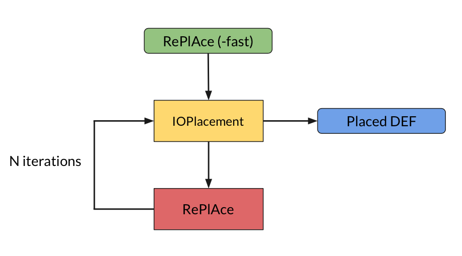

# ioPlacer

ioPlacer finds an near-optimal placement for IO pins through the use of a Hungarian Matching Algorithm.

## Getting Started

### Pre-Requisite
- GCC compiler and libstdc++ static library
- boost library

### Clone Repository
```
git clone --recursive https://github.com/The-OpenROAD-Project/ioPlacer.git
```

### How to Compile

#### Standalone binary
````
cd ioPlacer/
make PARALLEL=nthreads
````
NOTE: use `PARALLEL=nthreads` instead of `-j nthreads`

The binary file will be on ioPlacer's base folder.

#### Static library
````
cd ioPlacer/
make lib
`````

The library file (libioPlacer.a) will be on the repository root folder

### Definitions

#### Edge
An edge represents a core boundary. Below there is a visual representation of how the algorithm understands the boundaries.
```
        /********************************************
         *                 <----                    *
         *                                          *
         *                 3st edge     upperBound  *
         *           *------------------x           *
         *           |                  |           *
         *   |       |                  |      ^    *
         *   |  4th  |                  | 2nd  |    *
         *   |  edge |                  | edge |    *
         *   V       |                  |      |    *
         *           |                  |           *
         *           x------------------*           *
         *   lowerBound    1st edge                 *
         *                 ---->                    *
         *******************************************/
```

#### Slot
A slot is a valid position for a IO pin.
This position usually is in the core boundary where a track of the given metal layer is present.
The slots are created following the edges (1, 2, 3, and then 4 as show above).

#### Section
A section is a set of sequential slots.
Each section is processed independently by the Hungarian matching algorithm.
When if using the random placement, the number and capacity of sections as well as related arguments (e.g., pin spread, increase factor) are not considered.

## Basic Usage

### Arguments

To properly run IO Placement there are a few mandatory arguments that must be defined.
- **-l** : Input LEF file, the LEF file that contains information for IO pins boundaries and database unity (e.g.: -l ispd18_test2.input.lef)
- **-d** : Input DEF file, the DEF file that will be evaluated (e.g.: -d ispd18_test2.input.def)
- **-o** : Output DEF file, the name of the output file, where the new placement will be saved (e.g.: -o ispd18_test2.output.def)
- **-h** : Horizontal metal layer, this should be an integer number indicating the metal layer (e.g.: -h 5)
- **-v** : Vertical metal layer, the usage is the same as horizontal metal layer

There are optional flags that can be used.
- **-w** : Indicates whether or not the IO nets HPWL is returned; default value is 0 (false)
- **-f** : Force pins to be spread in core, i.e., try to respect number of slots for each section before dynamically changing these values
- **-r** : Performs a random IO placement; 0 (default, disabled) 1 fully random, 2 evenly distributed, 3 group on the middle of core edge
- **-n** : Number of slots per section (e.g.: -n 300)
- **-s** : Increase factor (%) of slots per section (e.g.: -s 0.8)
- **-m** : Percentage of usage for each section (e.g.: -m 1.0)
- **-x** : Increase factor (%) of usage for each section (e.g.: -x 0.05)
- **-b** : Name of the file containing the blocked areas. One blocked area per line. Line format: initialX initialY finalX finalY (e.g.: 0 1000 0 902900)

### Run a single placement
Your command line to run ioPlacer should look like this.
````
./ioPlacer -l input.lef -d input.def -o output.def -h 5 -v 6
````
You can also check the arguments and a brief description by running the following command.
````
./ioPlacer
````

### Example/Description of behavior

#### Random
`0` do *NOT* use random, i.e., normal Hungarian Algorithm.
`1` shuffle all slots creating a stack, pop top item and assign to first IO pin
`2` shuffle all IO pins, walk edges (see above) placing pins in equal distances
`3` shuffle all IO pins; divide in 4 groups; assign each group to a edge; start placing on sequential slots from the middle of the edge.

### Force pin spread
If a design has 100 pins, each section has 10 slots (`-n 10`) and only 50% can be used (`-m 0.5`), then only 5 pins can be placed in each section.
If ioPlacer tries to assign a pin to a section with 5 IO pins, instead of increasing the size using `-s` or the usage with `-x` it will assign the IO pin to the next section.
In the case  where there are no other section available, then the program falls back to using the `-s and -x` values to change the capacity and usage for the next iteration.

### Manual integration with RePlAce
You can run ioPlacer with RePlAce, using the following script:
````
bash ./RePlAce-pin/scripts/replace_ioplace_loop.sh <ioPlacerBin> <ioplacerArgs> <RePlAceBin> <replaceArgs> <iterations> <lefFile> <defFile> <output> <defName> <hasIoPlace>
````
Each parameter of the script is described below:
- **ioPlacerBin** : Path to the binary of ioPlacer
- **ioplacerArgs** : Arguments for ioPlacer. Except LEF file, DEF file and output DEF, any other parameter can be passed through this argument
- **-RePlAceBin** : Path to the binary of RePlAce
- **replaceArgs** : Argments for RePlAce. Except LEF file, DEF file, output directory and bmflag, any other parameter can be passed through this argument
- **iterations** : The number of iterations of the loop. If this number is 0, the script will only run RePlAce with -fast flag + ioPlacer
- **lefFile** : Path to the LEF file
- **defFile** : Path to the DEF file
- **output** : Directory where all the logs, RePlAce files and final DEFs will be stored
- **defName** : Name of the DEF file, without .def extension. It is used to correctly handle with RePlAce output directories.
- **hasIoPlace** : Boolean to indicate if DEF have previous pin placement

This script implement a loop with RePlAce and ioPlacer, as shown bellow:


An example with a benchmark from ISPD18 contest is shown below:
````
bash ./scripts/replace_ioplace_loop.sh ioPlacer/build/ioPlacer '-h 3 -v 4' RePlAce/build/replace '-den 0.8 -plot' 5 ispd18_test2/ispd18_test2.input.lef ispd18_test2/ispd18_test2.input.def output ispd18_test2.input 1
````

## API

### Disclaimers
- The type *point* is a xy position defined in IOPlacement.h, e.g., point(lowerX, lowerY).
- The type *box* is a rectangle defined by two points, e.g., box(point(lowerX, lowery), point(upperX, upperY))
- The type DBU is a long long int

### Initialize Data Structures

Before running ioPlacer the data structures should be initialized.
`````
void initCore(point lowerBounds, point upperBounds, DBU minSpacingX,
                      DBU minSpacingY, DBU initTrackX, DBU initTrackY,
                      DBU minAreaX, DBU minAreaY, DBU minWidthX, DBU minWidthY);
``````
The function *initCore* initiliazes the circuit core. Six parameters should be passed to this function:
- **lowerBounds** - the lower left core bound.
- **upperBounds** - the upper right core bound.
- **minSpacingX** - the minimum distance between IO pins on the x-axis.
- **minSpacingY** - the minimum distance between IO pins on the y-axis.
- **initTrackX** - position of the first track in X.
- **initTrackY** - position of the first track in Y.
- **minAreaX** - minimum area of the layer choosed to place the pins on the x-axis
- **minAreaY** - minimum area of the layer choosed to place the pins on the y-axis
- **minWidthX** - minimum width of the layer choosed to place the pins on the x-axis
- **minWidthY** - minimum width of the layer choosed to place the pins on the y-axis
````
void setMetalLayers(int horizontalMetalLayer, int verticalMetalLayer);
``````
The function *setMetalLayers* defines on which layers the pins should be placed.
````
void addIOPin(std::string name, std::string netName, box bounds,
                      std::string direction);
`````
The function *addIOPin* adds an IOPin to the data structure. All IO Pins should be individually added through this function.
- **name** - IO pin name.
- **netName** - net to which this pin is connected.
- **bounds** - bounds that indicate the shape of the pin.
- **direction** - direction of the pin. A pin can have one of the following directions: "INPUT", "OUTPUT" or "INOUT".
`````
void addInstPin(std::string net, std::string pinName, point pos);
`````
The function *addInstPin* adds a pin of an instance to the data structure. All pins should be individually added through this function.
- **net** - net to which this pin is connected.
- **pinName** - pin name.
- **pos** - pin position.

### Optional Parameters
A few parameters in ioPlacer are optional, they are set to a default value but can be changed if needed.
``````
void setSlotsPerSection(unsigned slotsPerSection, float increaseFactor);
``````
The function *setSlotsPerSection* sets the number of slots per section and the increase factor. If the algorithm can not assign each pin to a section, the number of slots per section is increased by this factor, e.g., 0.1f = 10% increase.
`````
void setSlotsUsagePerSection(float usagePerSection, float increaseFactor);
``````
The function *setSlotsUsagePerSection* sets the maximum slot usage per section.
- **usagePerSection** - maximum slot usage, e.g., 0.2f = 20% of the slots in a section can be utilized.
- **increaseFactor** - if the algorithm can not assign each pin to a section, the slot usage is increased by this factor, e.g., 0.1f = 10% increase.
```````
void forcePinSpread(bool force);
```````
The function *forcePinSpread* defines if ioPlacer should try to force the spread of IO Pins if the algorithm can not assign each pin to a section or if it should immediately increase the section's usage.

### Running ioPlacer and Retrieving Results
````
std::vector<Pin_t> run(bool returnHPWL = false);
`````
After everything is properly set, the *run* function should be called. If a *true* argument is passed, this function prints the IO Pins HPWL.
This function returns a vector with Pin_t structs. This struct is defined in IOPlacement.h, it contains the name of the IO pin, its new position and its orientation (e.g., 'N', 'S', 'W' or 'E').

# Authors
- Vitor Bandeira
- Mateus Fogaça
- Eder Monteiro
- Isadora Oliveira
